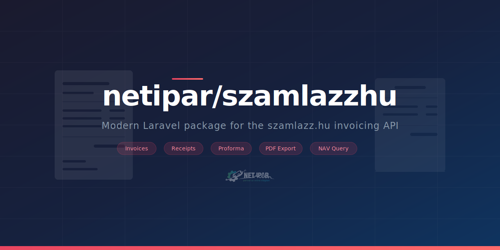

<picture>
  <source media="(prefers-color-scheme: dark)" srcset="art/banner.svg">
  
</picture>

# Szamlazz.hu for Laravel

[](https://packagist.org/packages/netipar/szamlazzhu)
[](https://github.com/NETipar/szamlazzhu/actions?query=workflow%3ATests+branch%3Amain)
[](https://packagist.org/packages/netipar/szamlazzhu)

Modern Laravel package for the [szamlazz.hu](https://www.szamlazz.hu) invoicing API. Generate invoices, receipts, proforma invoices, delivery notes, query invoice data, download PDFs, and more.

Based on the official [szamlazz.hu PHP SDK](https://docs.szamlazz.hu/hu/php/changelog#21023---20251126) v2.10.23, rebuilt for Laravel with modern PHP 8.1+ features.

## Quick Example

```php
use NETipar\Szamlazzhu\Client;
use NETipar\Szamlazzhu\Document\Invoice;
use NETipar\Szamlazzhu\Entity\Buyer;
use NETipar\Szamlazzhu\Enums\PaymentMethod;
use NETipar\Szamlazzhu\Item\InvoiceItem;

$client = app(Client::class);

$invoice = new Invoice();
$invoice->getHeader()->setPaymentMethod(PaymentMethod::BankTransfer);

$invoice->setBuyer(new Buyer(
    name: 'Customer Kft.',
    zipCode: '1234',
    city: 'Budapest',
    address: 'Main Street 1.',
));

$item = new InvoiceItem();
$item->setName('Product name')
    ->setNetUnitPrice(10000.0)
    ->setQuantity(2.0)
    ->setVat('27')
    ->setNetPrice(20000.0)
    ->setVatAmount(5400.0)
    ->setGrossAmount(25400.0);
$invoice->addItem($item);

$result = $client->generateInvoice($invoice);

$result->isSuccess();         // true
$result->getDocumentNumber(); // 'E-PREFIX-2026-001'
$result->getPdfFile();        // PDF binary string
```

## Requirements

- PHP 8.2+
- Laravel 10, 11, or 12
- A [szamlazz.hu](https://www.szamlazz.hu) account with API key

## Installation

```bash
composer require netipar/szamlazzhu
```

Publish the config file:

```bash
php artisan vendor:publish --tag=szamlazzhu-config
```

Add your API key to `.env`:

```
SZAMLAZZHU_API_KEY=your-agent-key
```

## Usage

### Obtaining the Client

Always obtain the `Client` via dependency injection or the service container:

```php
use NETipar\Szamlazzhu\Client;

// Dependency injection (preferred)
public function handle(Client $client): void
{
    $result = $client->generateInvoice($invoice);
}

// Or via service container
$client = app(Client::class);
```

### Generate an Invoice

```php
use NETipar\Szamlazzhu\Client;
use NETipar\Szamlazzhu\Document\Invoice;
use NETipar\Szamlazzhu\Entity\Buyer;
use NETipar\Szamlazzhu\Entity\Seller;
use NETipar\Szamlazzhu\Enums\Currency;
use NETipar\Szamlazzhu\Enums\Language;
use NETipar\Szamlazzhu\Enums\PaymentMethod;
use NETipar\Szamlazzhu\Item\InvoiceItem;

$invoice = new Invoice();

$header = $invoice->getHeader();
$header->setIssueDate(now()->format('Y-m-d'));
$header->setFulfillment(now()->format('Y-m-d'));
$header->setPaymentDue(now()->addDays(8)->format('Y-m-d'));
$header->setPaymentMethod(PaymentMethod::BankTransfer);
$header->setCurrency(Currency::HUF);
$header->setLanguage(Language::Hungarian);
$header->setComment('Invoice comment');

$invoice->setSeller(new Seller(
    bankName: 'OTP Bank',
    bankAccountNumber: '11111111-22222222-33333333',
));

$invoice->setBuyer(new Buyer(
    name: 'Customer Kft.',
    zipCode: '1234',
    city: 'Budapest',
    address: 'Main Street 1.',
    taxNumber: '12345678-1-42',
    email: 'customer@example.com',
));

$item = new InvoiceItem();
$item->setName('Product name')
    ->setNetUnitPrice(10000.0)
    ->setQuantity(2.0)
    ->setQuantityUnit('db')
    ->setVat('27')
    ->setNetPrice(20000.0)
    ->setVatAmount(5400.0)
    ->setGrossAmount(25400.0);
$invoice->addItem($item);

$result = $client->generateInvoice($invoice);

$result->isSuccess();         // bool
$result->getDocumentNumber(); // e.g. 'E-PREFIX-2026-001'
$result->getPdfFile();        // PDF binary string or null
```

### Generate a Receipt

```php
use NETipar\Szamlazzhu\Document\Receipt;
use NETipar\Szamlazzhu\Entity\Buyer;
use NETipar\Szamlazzhu\Enums\Currency;
use NETipar\Szamlazzhu\Enums\PaymentMethod;
use NETipar\Szamlazzhu\Item\ReceiptItem;

$receipt = new Receipt();
$receipt->getHeader()->setPrefix('NYGTA');
$receipt->getHeader()->setPaymentMethod(PaymentMethod::Cash);
$receipt->getHeader()->setCurrency(Currency::HUF);

$receipt->setBuyer(new Buyer(name: 'Customer Name'));

$item = new ReceiptItem();
$item->setName('Item name')
    ->setNetUnitPrice(10000.0)
    ->setQuantity(1.0)
    ->setQuantityUnit('db')
    ->setVat('27')
    ->setNetPrice(10000.0)
    ->setVatAmount(2700.0)
    ->setGrossAmount(12700.0);
$receipt->addItem($item);

$result = $client->generateReceipt($receipt);
```

### Generate a Proforma Invoice

```php
use NETipar\Szamlazzhu\Document\Proforma;

$proforma = new Proforma();
// Same structure as Invoice: getHeader(), setSeller(), setBuyer(), addItem()
$result = $client->generateProforma($proforma);
```

### Generate a Delivery Note

```php
use NETipar\Szamlazzhu\Document\DeliveryNote;

$note = new DeliveryNote();
// Same structure as Invoice: getHeader(), setSeller(), setBuyer(), addItem()
$result = $client->generateDeliveryNote($note);
```

### Reverse (Storno) an Invoice

```php
use NETipar\Szamlazzhu\Document\ReverseInvoice;

$invoice = new ReverseInvoice();
$invoice->getHeader()->setInvoiceNumber('E-PREFIX-2026-001');

$result = $client->generateReverseInvoice($invoice);
```

### Reverse (Storno) a Receipt

```php
use NETipar\Szamlazzhu\Document\ReverseReceipt;

$receipt = new ReverseReceipt();
$receipt->getHeader()->setReceiptNumber('NYGTA-2026-1');

$result = $client->generateReverseReceipt($receipt);
```

### Record a Payment

```php
use NETipar\Szamlazzhu\CreditNote\InvoiceCreditNote;
use NETipar\Szamlazzhu\Document\Invoice;

$invoice = new Invoice();
$invoice->getHeader()->setInvoiceNumber('E-PREFIX-2026-001');

$creditNote = new InvoiceCreditNote(
    date: now()->format('Y-m-d'),
    amount: 25400.0,
);
$invoice->addCreditNote($creditNote);

$result = $client->payInvoice($invoice);
```

### Query Invoice Data

```php
use NETipar\Szamlazzhu\Enums\LookupType;

// By invoice number (default)
$result = $client->getInvoiceData('E-PREFIX-2026-001');

// By order number
$result = $client->getInvoiceData('ORD-123', LookupType::OrderNumber);

if ($result->isSuccess()) {
    $data = $result->toArray();
}
```

### Download Invoice PDF

```php
use Illuminate\Support\Facades\Storage;

$result = $client->getInvoicePdf('E-PREFIX-2026-001');
$pdf = $result->toPdf();

if ($pdf) {
    Storage::put('invoices/E-PREFIX-2026-001.pdf', $pdf);
}
```

### Query Receipt Data

```php
$result = $client->getReceiptData('NYGTA-2026-1');

if ($result->isSuccess()) {
    $data = $result->toArray();
}
```

### Download Receipt PDF

```php
$result = $client->getReceiptPdf('NYGTA-2026-1');
$pdf = $result->toPdf();

if ($pdf) {
    Storage::put('receipts/NYGTA-2026-1.pdf', $pdf);
}
```

### Query Taxpayer Data

```php
// Pass the first 8 digits of the tax number
$result = $client->getTaxPayer('12345678');

if ($result->isSuccess()) {
    $data = $result->toArray();
}
```

### Delete a Proforma Invoice

```php
use NETipar\Szamlazzhu\Enums\LookupType;

// By proforma number (default)
$result = $client->deleteProforma('D-PREFIX-2026-001');

// By order number
$result = $client->deleteProforma('REND-2026-001', LookupType::OrderNumber);
```

## Document Types

| Class | Purpose |
|---|---|
| `Invoice` | Standard invoice |
| `PrePaymentInvoice` | Pre-payment (advance) invoice |
| `FinalInvoice` | Final invoice |
| `CorrectiveInvoice` | Corrective invoice |
| `ReverseInvoice` | Reverse (storno) invoice |
| `Receipt` | Receipt |
| `ReverseReceipt` | Reverse (storno) receipt |
| `Proforma` | Proforma invoice |
| `DeliveryNote` | Delivery note |

All document classes live in `NETipar\Szamlazzhu\Document\`.

## Enums

Always use enum cases instead of raw strings:

- **`PaymentMethod`** - `BankTransfer`, `Cash`, `CreditCard`, `Check`, `CashOnDelivery`, `PayPal`, `Szep`, `Otp`, `Compensation`, `Voucher`, `Barion`, `Other`
- **`Currency`** - `HUF`, `EUR`, `USD`, `GBP`, `CHF`, and 30+ ISO currencies
- **`Language`** - `Hungarian`, `English`, `German`, `Italian`, `Romanian`, `Slovak`, `Croatian`, `French`, `Spanish`, `Czech`, `Polish`
- **`VatRate`** - `Percent27`, `Percent5`, `Percent0`, `TAM`, `AAM`, `EU`, `EUK`, `MAA`, and more
- **`LookupType`** - `InvoiceNumber`, `OrderNumber`, `ExternalId`
- **`DocumentType`** - `Invoice`, `ReverseInvoice`, `CorrectiveInvoice`, `PrepaymentInvoice`, `FinalInvoice`, `Proforma`, `DeliveryNote`, `Receipt`, `ReverseReceipt`

## Response Handling

Every Client method returns an `ApiResponse`:

```php
$result->isSuccess();         // bool
$result->isFailed();          // bool
$result->getDocumentNumber(); // string|null
$result->getPdfFile();        // string|null (binary PDF)
$result->toPdf();             // string|null (alias)
$result->toArray();           // array|null
$result->toJson();            // string|null
$result->toXml();             // string|null
$result->getErrorMsg();       // string|null
$result->getErrorCode();      // int|null
```

## Error Handling

```php
use NETipar\Szamlazzhu\Exceptions\SzamlazzhuException;
use NETipar\Szamlazzhu\Exceptions\ConnectionException;
use NETipar\Szamlazzhu\Exceptions\ResponseException;
use NETipar\Szamlazzhu\Exceptions\ValidationException;
use NETipar\Szamlazzhu\Exceptions\XmlBuildException;

try {
    $result = $client->generateInvoice($invoice);
} catch (ConnectionException $e) {
    // Network / connection error
} catch (ResponseException $e) {
    // API response error
} catch (ValidationException $e) {
    // Input validation error
} catch (XmlBuildException $e) {
    // XML generation error
} catch (SzamlazzhuException $e) {
    // Base exception (catches all above)
}
```

## Entity Properties

All entity, header, item, and document properties are **public** and can be read or written directly. Fluent setters are also available for chaining:

```php
$buyer = new Buyer(
    name: 'Company Name',
    zipCode: '1234',
    city: 'Budapest',
    address: 'Street 1.',
);

// Direct property access
$buyer->taxNumber = '12345678-1-42';
$buyer->email = 'email@example.com';

// Or fluent setters (chainable)
$buyer->setPhoneNumber('+36201234567')->setComment('Note');
```

## Configuration

Key `.env` variables:

```
SZAMLAZZHU_API_KEY=your-agent-key
SZAMLAZZHU_DOWNLOAD_PDF=true
SZAMLAZZHU_SAVE_PDF=true
SZAMLAZZHU_TIMEOUT=30
SZAMLAZZHU_SESSION_DRIVER=cache
SZAMLAZZHU_LOG_CHANNEL=null
```

The session driver supports `cache` (default), `file`, `database`, and `null` (for testing).

## Testing

```bash
composer test
```

## Credits

- [NETipar](https://netipar.hu)

## License

The MIT License (MIT). Please see [License File](LICENSE.md) for more information.
